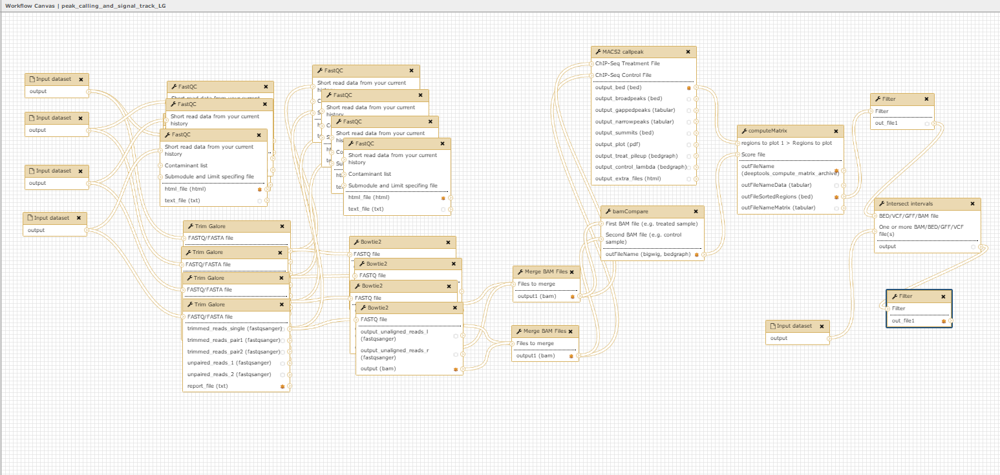
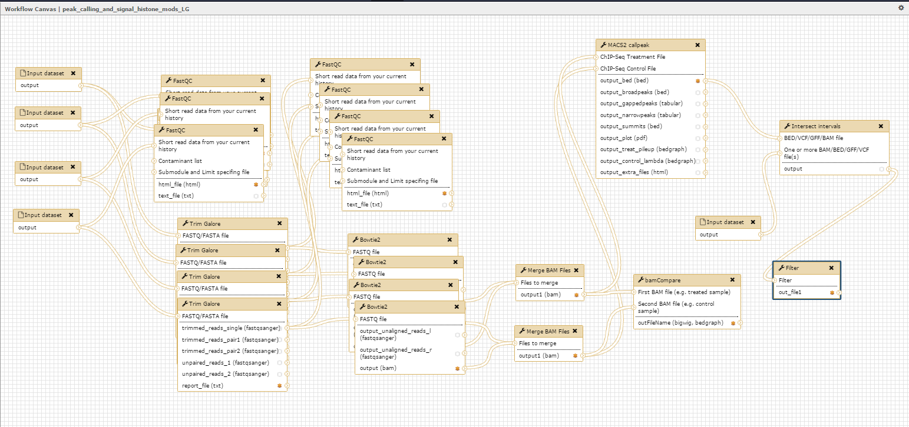

Galaxy workflow for peak calling and signal track generation for transcription factor ChIP-seq data
---------------------------------------------------------------------------------------------------

A simple workflow to identify binding sites for transcription factors as assessed by ChIP-seq analysis and to generate
ChIP-seq signal tracks, which are normalized to input samples and can be used for visualization and further analysis.
This workflow is generated for two replicates of ChIP and input sample, respectively. 

Author: Dr. Laura Glaser

Galaxy workflow for peak calling and signal track generation for histone modification ChIP-seq data
---------------------------------------------------------------------------------------------------

A simple workflow to identify binding sites for histone modifications as assessed by ChIP-seq analysis and
to generate ChIP-seq signal tracks, which are normalized to input samples and can be used for
visualization and further analysis. This workflow is generated for two replicates of ChIP and input sample, respectively.

Author: Dr. Laura Glaser
